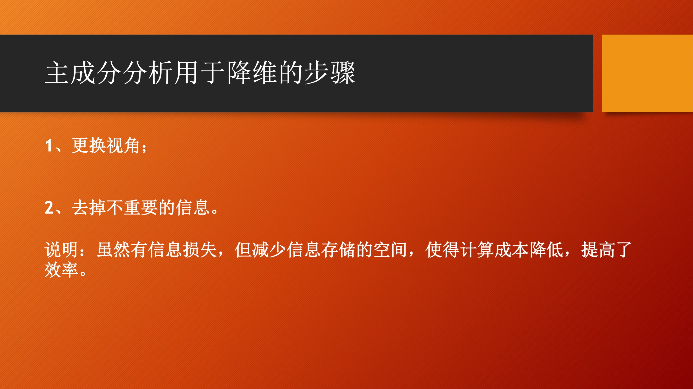

# 白话”主成分分析“ 2 ：通过主成分分析复习“线性代数”


这一部分对于应用来说，其实没有什么用，我个人觉得，通过对于主成分分析的学习，帮助了我复习了在《线性代数》中的许多概念了定理，可以说“主成分分析”是一个很好的帮助复习“线性代数”的材料。


事实上，降维的方法有很多，直接去掉一部分没有用的特征是一种办法，而 PCA 是其中一种降维的思路，PCA 先让你更换视角，转换到“上帝视角”，然后在“上帝视角”下，去掉最不重要的几个特征，而上帝视角中，最重要的几个特征依次称为“第一主成分”、“第二主成分”，依次这样命名下去。

主成分分析用于降维是怎么做的呢？




线性变换可以使用矩阵描述。

说明：坐标系发生变化，即坐标轴发生了变化。这个发生变化的过程可以描述成**对原始坐标轴（“基底”）施行一个线性变换**。线性变换的特点是线性变换保持系数不变，这也是线性变换的定义。而线性变换可以用一个矩阵 $P$ 来表示，这个矩阵 $P$ 其实就可以用两组基底之间的过渡矩阵表示。

将原始数据用新的坐标系中的坐标来表示

在机器学习中，<b><font size='3' color='0000ff'>一个数据可以看成是一系列特征的坐标，更换视角是更换坐标系，将数据表达成在新的坐标系下的坐标，这些坐标表示的信息由大到小依次排列，根据实际的需要，我们可以选择保留其中重要的部分</font></b>。

主成分分析就是在分析新坐标系的坐标轴是什么。降维得到的坐标就是原始数据在新坐标系下的坐标的一部分，即靠前的那一部分。

PCA 用于降维首先更换坐标系，在新视角下直接去掉并不太重要的特征，得到原始事物的低维度表达，这个低维度表达仍然可以保留原始事物的绝大部分信息。

这就像你准备一场考试，你可能摸不着头脑，你按照你对内容的感兴趣程度复习，所有书都带上，但是你的精力有限，你学习得有点辛苦，突然有一天，一个你要考的这门考试的专家来了，他帮你从他应试的角度出发，把你的学习资料重新分类，帮你按照重要性排了个序。那些不太重要的书就帮你直接丢了，因为复习它们占用精力和时间且不能帮你带来更多成绩的提升。


### 3.6 


## 二、什么是主成分？如何用于降维？

“主成分”就是我们上面说的坐标轴方向，既然是方向，就可以用向量表示。所以，请你先记住，主成分是一个向量，并且是列向量，是我们主成分分析要求的目标。

我们常见的空间直角坐标系的坐标轴方向就可以称之为主成分。请看下图：


在这里，我们再给出主成分的一些描述，你不妨先有个印象：

1、主成分是坐标轴方向，我们知道，在空间中，方向可以用向量表示，向量表示的好处是：把方向定义成为**有序实数**，以便参与运算；

2、既然是方向，这个向量的大小其实无关紧要，很多时候，我们会限制这个方向的大小为 $1$，即向量的模长为 $1$，这一点是很重要的，马上我们就可以看到，这么做可以方便我们的计算；

3、各个主成分如果是互相垂直的，是最好的，是我们喜欢的样子，上面的图就是这种情况，在线性代数中，这种情况叫做”正交“，结合上面的第 2 点，各个主成分是单位向量，并且相互正交，构成了单位正交向量组，单位正交向量组有些书上也叫标准正交组，单位正交向量组就是标准正交基，直角坐标系就是最具体，最好理解的标准正交基，说到这里是不是能让你勾起一些美（tong）好（ku）的回忆呢？如果你忘了，可以翻一翻《线性代数》的教材，这些概念非常重要。

下面再给出一个关于”标准正交基“非常重要的结论，这也是我们为什么喜欢”标准正交基“的原因，<b><font size='3' color='ff0000'>因为在标准正交基下，内积的运算变得十分简单</font></b>：

> 如果两个向量的坐标使用标准正交基表示，那么它们内积的计算，就可以通过它们的坐标对应相乘，然后相加得到。

想想内积的原始定义 $\alpha \cdot \beta = ||\alpha|| \cdot|| \beta|| \cdot \cos \theta$，如果不是在标准正交基的定义下，我们要计算向量的夹角（的余弦值），还有向量的模，是一件很麻烦的事。

对于这一部分忘记掉的朋友们，请一定花一点时间翻一翻《线性代数》教材”标准正交基“的部分，熟悉一下相关的概念和定理，其实并不难。

主成分分析只得到新坐标系，从 PCA 到降维，还有一步要走，用一个主成分按列排成的矩阵右乘即可，<b><font size='3' color='ff0000'>其实主成分分析应用于降维干的是”坐标变换“，使用新的坐标系表示原始数据，去掉那些在新的坐标系下一些不太重要的坐标，即达到了降维的效果</font></b>。


## 主成分分析在做什么?

下面写一句我自己都觉得是废话的话：

> 主成分分析就是在找主成分，即找坐标轴方向。

具体说来，就是在原始空间（可以认为是 $n$ 维线性空间，这里 $n$ 在机器学习中可以认为是一个数据的特征的个数）中找到另外 $n$ 个线性无关的向量，这 $n$ 个线性无关的向量就是我们要找的坐标轴方向，它满足以下性质：

1、这 $n$ 个向量，不仅仅是线性无关的，而且还是正交的；

下面对这一点进行以下几点说明：

+ 可以形象地把”线性无关“理解成”不共线“，把”正交“理解成”垂直“，这一条就是在说，这些个坐标轴方向不仅仅得是不共线的，还得是互相垂直的；
+ ”线性代数“中，”正交“就是比”线性无关“更强的一种描述两个向量关系的描述；
+ 在求解的过程中，我们还可以发现，我们可以得到这些向量的模长都为 $1$，这一点是极其有用的，可以简化计算。

2、假设所有的数据投影到主成分 1 以后，得到一组实数值，它们的方差是 $s_1$，所有的数据投影到主成分 2 以后，得到一组实数值，它们的方差是 $s_2$，依次类推，所有的数据投影到主成分 $n$ 以后，得到一组实数值，它们的方差是 $s_n$，则有 $s_1 \ge s_2 \ge \cdots \ge s_n$。

说到这里，终于可以说出主成分分析在干嘛了，<b><font size='3' color='ff0000'>主成分分析就是在寻找一组原始空间的基向量，使得原始数据在这组基向量的表示下，满足以下 2 点：</font></b>

1、各个特征线性无关；

2、各个特征的方差依次减少。

下面依次解释这两点：

### 


## 主成分分析如何用于降维

主成分分析用于降维是是找坐标轴方向（基向量），进而得到新的基向量的坐标表示（使用矩阵相乘就可以了），然后在新的坐标表示下，去掉那些方差很小的特征。

主成分分析就是这样降维的，看到后面，你就会知道：

1、主成分其实是原始空间基向量的线性组合，这一步其实在机器学习里面可以理解为”**特征抽取**“；

2、主成分按**列**排成的矩阵其实就是”线性代数“里介绍的过渡矩阵；

3、如果原始数据有 $m$ 个，每个数据有 $n$ 个特征，原始坐标用一个 $(m \times n)$ 矩阵 $X$ 表示，那么过渡矩阵就是一个  $(n \times n)$ 矩阵（主成分是一个 $n$ 维列向量，一共有 $n$ 个，它们按列排成矩阵，也是一个方阵），我们用 $P$ 表示，把原始数据在新的坐标轴下表示成矩阵是 $P$，$P$ 也是一个 $(m \times n)$ 矩阵，它们的关系是
$$
X \times  P =  Y
$$

这个关系如果不太理解，没有关系，看到后面，我会介绍为什么是右乘矩阵 $P$。

4、降维就是在 $Y$ 中，直接去掉方差小的特征，保留方差比较大的特征，进而达到降维的效果，这一步可以理解成机器学习中的”特征选择“。

因此主成分分析用于降维可以归纳成：


说到这里，可能比较抽象，这里举一个我的直观理解。数据还是那个数据，只不过我们用不同的坐标表示，相当于我们换了一个视角（特征抽取），这个新视角有不同的维度，这些维度的信息重要度从高到低排列，我们不看那些重要度低的信息（特征选择）。


- [ ] 这里配图。

正如这站图所示，这些点在 $3$ 维空间中其实是处于一个平面上的，那么我们就干脆旋转坐标轴（特征抽取），使得这些数据在第 $3$ 维坐标上都表示成一样（取 $0$ 最好理解），这样这些数据就可以用  $2$ 维表示（特征选择）。

## 过渡矩阵 $P$ 怎么求？

首先我们介绍一个非常简单的事实，如何求一个向量在新的基下的坐标表示。这部分我手写一下。


看到这里，我们再解释一下，为什么原始矩阵 $X$ 右乘矩阵 $P$，可以得到 $Y$。**$P$ 是待求的标准正交基按列排成的矩阵**。按照矩阵乘法规则和上面手写的分析，$X$ 的每一行与 $P$ 的每一列做内积，得到的就是坐标，其实就是这么简单。

要求 $P$，我们得看看 $P$ 除了是标准正交基以外，还得满足什么条件？貌似没有了啊。不过我们对 $Y$ 是有要求的呀，看看上面说的：

1、$Y$ 的各个列向量线性无关；

2、$Y$ 的各个列向量的方差逐渐减少。

第 1 条 ”$Y$ 的各个列向量线性无关“，即两个列向量的内积为 $0$，等价的表示就是它们的协方差为 $0$，第 2 条”$Y$ 的各个列向量的方差逐渐减少“，提到了方差。能把方差和协方差联系在一起的就是协方差矩阵了，它就是 $\cfrac{1}{m-1}Y^TY$，这里 $Y^T$ 是 $Y$ 的转置。如果 $Y$ 表示成 $(\vec y_1,\vec y_2,\cdots,\vec y_n)$，即 $n$ 个特征向量，那么 $\cfrac{1}{m-1}Y^TY$ 这个矩阵的主对角线上的元素就是各个特征的方差，非主对角线上的元素，就是各个不同特征的协方差，那么上面两条，就可以归并成一条，即 
$$
\cfrac{1}{m-1}Y^TY
$$
是对角矩阵，并且对角矩阵上的元素的值越来越小。

这里不太明白协方差矩阵的朋友们，可以翻一翻《概率论与数理统计》教材中，关于协方差，协方差矩阵的定义，这里是主成分分析的关键部分了，可以慢一点看。

接下来，我们要写一大堆等价条件了：

$$
\cfrac{1}{m-1}Y^TY
$$

是对角矩阵，有因为 $XP=Y$ ，代入消去 $Y$，变成 $XP$ 的表达式，即

$$
\begin{aligned}
\cfrac{1}{m-1}Y^TY &= \cfrac{1}{m-1}(XP)^T(XP)\\
&=\cfrac{1}{m-1}(P^TX^T)(XP)\\
&=\cfrac{1}{m-1}(P^T(X^TX)P)\\
&=P^T \left(\cfrac{1}{m-1}X^TX \right)P\\
\end{aligned}
$$
即我们希望
$$
P^T \left(\cfrac{1}{m-1}X^TX \right)P
$$
是对角矩阵。我们看看这个表达式的形式，当 $P$ 是正交矩阵的时候，$P^{-1}=P^T$，令 $A= \left(\cfrac{1}{m-1}X^TX \right)$，则我们希望 $P^{-1}AP$ 是一个对角矩阵，这不就是一个矩阵相似于一个对角矩阵的问题吗，而且，对角矩阵主对角线上的元素就是特征值，就是我们上面说的方差，这个矩阵 $A$ 还是一个对称矩阵，所以 $P$ 就是 $A$ 的特征向量按照特征值从大到下，按照列排成的矩阵。$A$ 是原始特征矩阵的协方差矩阵，因此，<b><font size='3' color='ff0000'>主成分分析就转化成原始特征矩阵的协方差矩阵的对角化问题，即对原始特征矩阵的协方差矩阵做特征值分解，得到特征向量按照特征值从大到小，依次就得到主成分1、主成分2、……、主成分 n</font></b>。

> 我们用类似于解方程一样的思想分析出矩阵 $P$ 是什么。从矩阵是线性变换的角度看，$P$ 是正交变换。这个正交变换将可能线性相关的变量转换成线性无关的变量。
>
> 这里特别说明一下，机器学习中的”特征“与线性代数中的特征值和特征向量中的”特征“完全不是一回事，不过我们可以很容易从上下文的表述中区分开来，这一点要注意。
>
> 至于协方差矩阵为什么在 $X^TX$ 前面的系数是 $\cfrac{1}{m-1}$ ，这是为了保证在数理统计中，根据样本得到的协方差的无偏性，这部分你可以在《概率论与数理统计》中找到。

这里涉及到的特征值和特征向量的定义和求法，如果忘记掉的朋友们，请一定翻翻《线性代数》教材复习一下，这些都是非常基础的知识，并且非常重要。

讲到这里，我们就可以归纳出主成分分析应用于降维的步骤了。

“投影”，其实就蕴含了降维的思想。我们后面还会多次用到“投影”这个概念。


## 4. 主成分分析相关的数学结论

这里我们先给出主成分分析的一些结论，在接下来的文章里，我们会慢慢分析：

- 上面说的“一个矩阵”就是原始数据的协方差矩阵，它是一个对称矩阵；
- 对称矩阵一定可以对角化，将对称矩阵对角化即是“对称矩阵的特征值分解”；
- 特征值就是原始数据的新坐标在各个新坐标轴上的投影的方差；
- 特征向量就是新坐标轴的方向向量；
- 特征向量按列排成构成的矩阵是正交矩阵；
- 原始数据在人为定义下使用的是标准正交基，左乘正交矩阵即对原始数据矩阵作正交变换，正交变换不改变标准正交性质，即正交变换使得标准正交基成为标准正交基；
- 正交变换的几何意义是“旋转”和“镜面反射”，所以主成分分析其实就是旋转或者镜像了坐标轴，并且重新定义了坐标轴顺序，让你知道哪些特征的区分度大，哪些特征的区分度小。


## 关于主成分分析应用于降维需要说明的几点

1、恢复矩阵

恢复矩阵其实就是左乘 $P^T$ 就可以了。

2、方差的比例代表了主成分的可解释性；

3、如果数据的噪声恰好是方差，主成分分析用于降维还有去燥的意外收获，但如果重要信息恰好在方差低的那些主成分上，则不能使用主成分分析来降维；

4、主成分分析得到的主成分一般而言，不具有可解释性，相当于上帝视角；

5、降维是一个有损失的操作，如果你的数据足够多（比特征个数多得多，大部分的数据能够覆盖到特征空间的所有位置），噪音少，机器上能够运行大规模的运算，那就不须要降维了；

6、在主成分分析中，实质性的超参数只有一个，主成分的个数，在一些机器学习算法的实现中，你可以传入具体的数值，即你想保留的主成分个数，如果是传入一个大于 0 小于 1 的浮点数，则表示保留主成分的方差占总方差的比值；

7、降维还有一个用处是，可以用于可视化。

扯一点没用的东西：PCA 和 SVD 学下来以后，你会发现，这和二八定理有一定的联系，少数的主成分掌握了矩阵大量的信息，是不是很神奇。

## 自己封装 PCA 类


## 使用 PCA 降维的例1：手写数字识别

数据少，特征多。

## 使用 PCA 降维的例2：人像数据识别


## PCA 用于降噪 


## PCA 的其它求法

1、最大投影方差：最大可分性

2、最小重构损失：最近重构性

周志华的批注。


## SVD 用于 PCA


## 扩展内容

1、特征选择的关键问题是对特征子集的评价，具体方法有：包裹法、过滤法、嵌入法；

2、scikit-learn 提供的用于降维的类，它们的思想；

例如：LDA（线性判别分析）、增量主成分、小批量稀疏主成分、稀疏主成分分析、截断的 SVD、因子分析、字典学习、稀疏编码、NMF（非负矩阵分解）。

有些背后的数学原理是非常难的，这里只是罗列出来，想挑战，想被虐的朋友们可以品尝一下，体验真香定律。

3、核 PCA 的思想中核函数是个什么东西，SVM 里也有核函数，是一回事吗？

4、PCA 数据线性降维，了解一下非线性降维的技术；

5、讲 PCA 的部分很少能离得开 SVD 的，有的时候 SVD 也可以直接用于降维，这部分内容可以了解一下。


## 参考资料

### 书籍资料

1、周志华《机器学习》

2、蜥蜴书第 8 章

3、《机器学习实战》

### 网络资料

1、张洋：PCA 的数学原理
http://blog.codinglabs.org/articles/pca-tutorial.html
说明：这篇博客几乎是被引用最多的，讲解 PCA 最清楚的博文了，本文的最关键部分也是看这篇博文而来。几乎是我看到的最通俗的解释了，还可以帮我们把”线性代数“中关于”线性变换“中的前后知识联系起来，是一个很好的复习材料。其它例如很有名的著作，例如周志华的《机器学习》，著名的花书《深度学习》都把寻找主成分这件事情变成了找最优化问题的最优解，要用到一些最基础的最优化理论的知识和矩阵求导的知识。

2、主成分分析（PCA）原理总结
https://www.cnblogs.com/pinard/p/6239403.html

3、用 scikit-learn 学习主成分分析(PCA)
https://www.cnblogs.com/pinard/p/6243025.html

```{.python .input}

```

